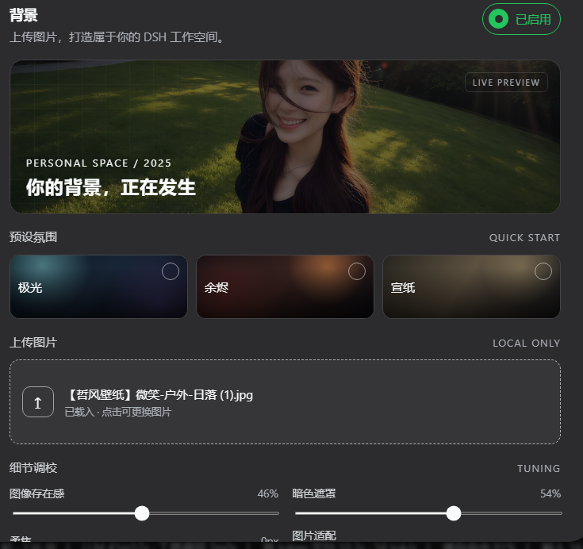
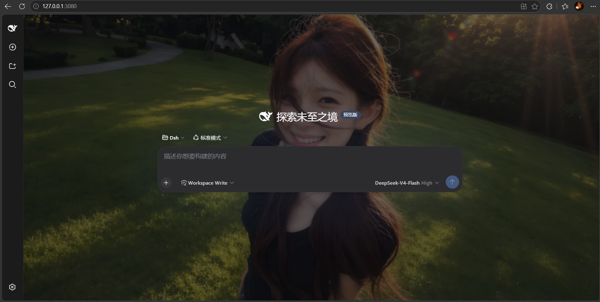

# DSH Background

> A DSH Cordis plugin that gives your DSH Web workspace a customizable background — atmosphere presets or your own image, persisted across restarts.

[简体中文](README.md) | **English**

---

## Why this plugin?

DSH Web ships with a single theme-colored background. If — like us — you want your workspace to feel **yours** instead of looking like everyone else's, you've probably already tried:

- **Editing theme files / CSS directly** — doesn't survive updates. DSH is plugin-architecture driven and its theme is built on CSS variables; any update overwrites your edits.
- **Userscripts or browser extensions** — invasive, selector-heavy, and needs to track every DSH release.
- **Just living with it** — staring at a flat monochrome surface all day is tiring and impersonal.

This plugin turns "background" into a **first-class setting item** using DSH's official Cordis plugin mechanism — and solves the three hardest problems along the way:

1. **Saves silently rejected** — DSH's host only lets *allowlisted* settings namespaces be read and written by the browser, otherwise saving rolls back. The plugin ships `scripts/expose-namespace.mjs` to add `ui-background` to the allowlist with one command.
2. **The conversation area hides the background** — the conversation pane, details panel and layout frame all paint opaque backgrounds. While a background is active the plugin makes those page-level containers transparent, while the sidebar, message bubbles and composer keep their own surfaces.
3. **Images vanishing after restart** — large images are slow to write and are lost. The plugin compresses images to ≤1600px WEBP in-browser, then **persists them the moment they are uploaded**, so they survive restarts untouched.

## Features

- 🖼️ **Upload your own image** — JPG / PNG / WEBP / GIF, compressed locally with Canvas (max edge 1600px, WEBP output — a good balance of quality and size). **Persisted immediately on upload**, no separate save step, restored automatically after restarts.
- 🎨 **Three atmosphere presets** — Aurora, Ember, Paper; one click to switch, takes effect instantly. No image hunting required for a quick mood change.
- 🎚️ **Five fine-tuning knobs** — image presence (opacity), dark overlay (keeps foreground readable), soft focus (blur), fit mode (fill / contain / stretch) and focal position (center / top / bottom / left / right).
- 🔄 **Live preview** — what you see in the settings panel is what you get; drag a slider and watch the conversation area update in real time. Discard anytime before saving.
- 🔒 **Privacy-friendly** — the image is processed only in your browser and written to your local settings document; **nothing is uploaded to any server**.
- 🌐 **Bilingual UI** — 中文 / English.
- 🧩 **Non-invasive, fully removable** — the background is a fixed browser layer; conversation content is never modified or covered. Turn off the *Enabled* switch or click *Restore default* to remove it completely.
- 🌗 **Theme agnostic** — works in both light and dark themes (the dark-mode screenshot below is the real effect).

## Screenshots

Settings panel (Settings → General → Background):



Dark mode with a custom image background:



## Installation

### ⚡ One-command install (recommended, beginner friendly)

One command does everything — **build → install → allowlist**:

```bash
# 1. Get the code: on GitHub click Code → Download ZIP and unzip, or:
git clone https://github.com/<your-name>/dsh-background.git
cd dsh-background

# 2. Install (defaults to the "web" profile):
node scripts/install.mjs

# 3. Restart DSH:
dsh web
```

Then open `http://127.0.0.1:3080` (**Ctrl+F5** to bypass the browser cache) and go to **Settings → General → Background**.

> Install into another profile: `node scripts/install.mjs --profile <your-profile>`
>
> If it says the `dsh` command is missing (you launch DSH via npx), set `DSH_CMD` and re-run:
> - Windows PowerShell: `$env:DSH_CMD = "npx @deepseek-ai/dsh"`
> - macOS / Linux: `export DSH_CMD='npx @deepseek-ai/dsh'`

### 🧑‍🔧 Manual install (understand each step)

**Step 1: Build the plugin** — turn the source into an installable `.tgz`:

```bash
pnpm pack --pack-destination .
```

**Step 2: Install into a DSH profile**:

```bash
dsh plugin --profile web add ./dsh-background-plugin-0.1.7.tgz
```

**Step 3: Expose the settings namespace (required, first install only)**

DSH's `dsh-host-apiproxy` only allows **allowlisted** settings namespaces to be read and written by the browser. If the namespace is missing, saves are silently rejected (`settings-not-exposed`) — you see the toggle flip back to "disabled" right after saving.

Run the bundled helper script to add `ui-background` to the allowlist (idempotent, safe to re-run):

```bash
node scripts/expose-namespace.mjs
```

If the script cannot locate your dsh installation, pass the file path explicitly:

```bash
node scripts/expose-namespace.mjs <path-to>/@deepseek-ai/dsh-host-apiproxy/lib/index.js
```

> Manual alternative: add `"ui-background"` to the `WEB_SETTINGS_NAMESPACES` array (right after `"ui-theme"`) inside the file above.

**Step 4: Restart and refresh**

```bash
dsh web
```

Open `http://127.0.0.1:3080` (hard-refresh with Ctrl+F5 if needed), then go to **Settings → General → Background**.

### ❓ FAQ

| Symptom | Fix |
|---|---|
| `pnpm not found` | Install pnpm: `npm install -g pnpm` (or `corepack enable`) |
| `dsh` command not found | Set the `DSH_CMD` env var and re-run (see one-command section) |
| Toggle flips back to "disabled" after saving | Allowlist not applied: re-run `node scripts/expose-namespace.mjs`, or add it manually (manual step 3) |
| Background not showing / page looks stale | **Ctrl+F5** hard refresh (browser cached the old bundle), or restart `dsh web` |
| Uploaded image lost after restart | Make sure the plugin is **0.1.6+** (uploads auto-save); older versions need "Save background" |
## Usage

1. Open **Settings → General → Background**.
2. Click a preset, or upload an image (it is persisted immediately — no need to hit Save).
3. Drag the *Image presence / Dark overlay / Soft focus* sliders to preview live, then press **Save background** to persist the tuning.
4. To remove the background: click **Restore default**, or turn off the **Enabled** switch and save.

## How it works

- The host plugin (`lib/index.js`) registers the `ui-background` namespace with a Schemastery schema via `@deepseek-ai/dsh-settings`, making the background a real part of DSH's settings system.
- The browser plugin (`lib/client.js`) registers the *Background* row in the `settings.general.item` slot and reads/writes settings through the DSH `settingsScope` — the same persistence mechanism official settings use.
- The background is a `position: fixed; z-index: 0` layer (`#dsh-background-layer`) pinned to the very bottom of the page. While active:
  - `--dsw-alias-bg-base` is overridden to `transparent` so the conversation pane, details panel and layout frame reveal the background;
  - the sidebar, message bubbles and composer use their own dedicated variables and stay opaque for readability;
  - dropdowns rendered via `createPortal` into `<body>` (e.g. the message "more" menu) keep their original positioning and stacking, so clicks keep working.
- Images are compressed to a data URL by Canvas and stored in the DSH settings document (`~/.dsh/settings.yaml`). Everything happens locally — nothing is uploaded.

## Project structure

```
dsh-background/
├── lib/
│   ├── index.js               # Host plugin: registers the ui-background namespace + schema
│   └── client.js              # Browser plugin: background layer, settings row, upload, persistence
├── scripts/
│   ├── install.mjs            # One-command installer (build + install + allowlist)
│   └── expose-namespace.mjs   # Helper: adds ui-background to the host allowlist
├── screenshots/               # Repo showcase screenshots
├── cordis.patch.yml           # DSH bundle patch: registers the plugin entry
├── package.json               # Plugin metadata (dsh.client injection)
├── CHANGELOG.md
└── LICENSE                    # MIT
```

## Development

```bash
node --check lib/client.js && node --check lib/index.js   # syntax check
pnpm pack --pack-destination .                            # build tarball
```

## License

[MIT](./LICENSE)
