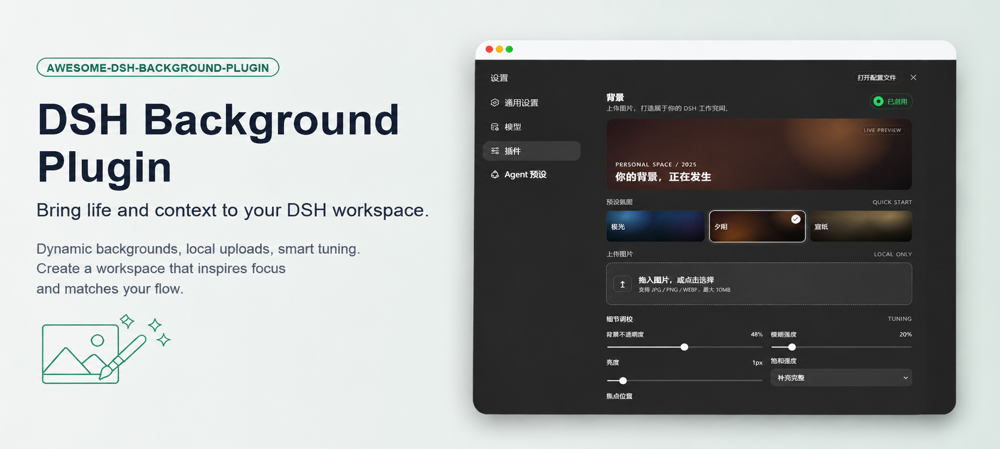
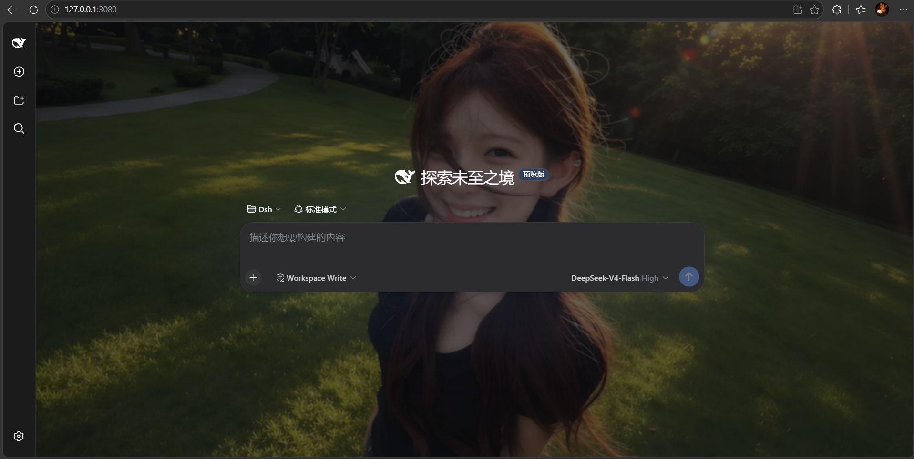
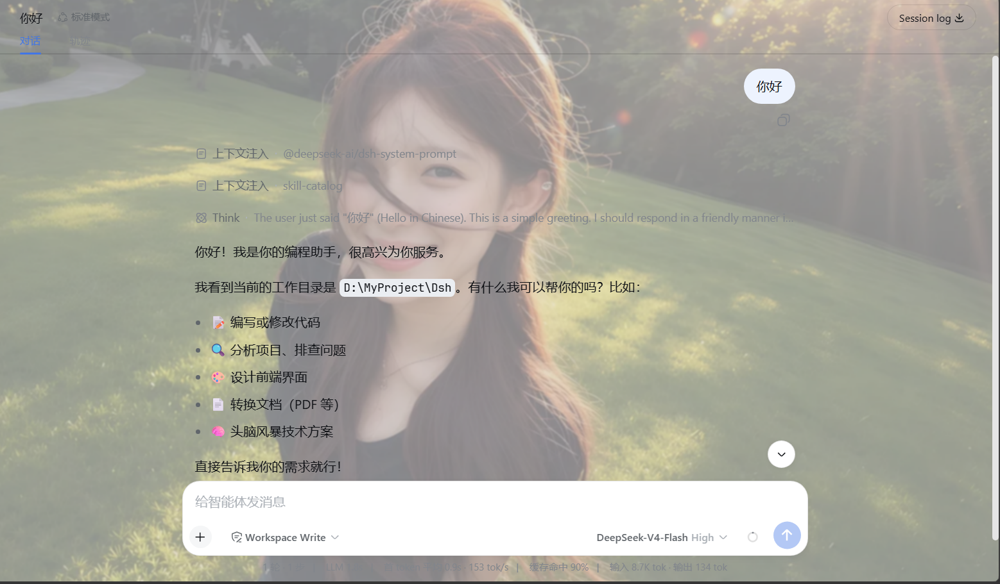

<p align="center">
  
</p>

# DSH Background

> 为 **DSH Desktop（桌面端）** 与 **DSH Web** 提供可上传图片 / 预设氛围的背景设置插件，设置持久化，重启不丢失。

**简体中文** | [English](README.en.md)

[](https://dsh.directory/plugins/leavestring/awesome-dsh-background-plugin)
[](https://github.com/leavestring/awesome-dsh-background-plugin/releases)
[](LICENSE)
[](package.json)
[](cordis.patch.yml)
[](cordis.patch.yml)
[](https://github.com/leavestring/awesome-dsh-background-plugin)

---

## ⚠️ 先看版本对应

DSH 的插件**按 profile 隔离**：装在 `web` 里的插件**不会**出现在桌面端，反之亦然。同时两个版本线的 DSH 内部 API 完全不同，插件也分两条版本线：

| 你在用 | DSH 版本 | 该装的插件版本 | 目标 profile |
|---|---|---|---|
| **DSH 桌面端**（Windows / macOS 应用） | `0.2.x` | **`0.2.1`** | `desktop` |
| `dsh web`（新版运行时） | `0.2.x` | `0.2.1` | `web` |
| `dsh web`（旧版运行时） | `0.1.x` | `0.1.9` | `web` |

- **怎么查自己的 DSH 版本**：命令行运行 `dsh --version`（桌面端用应用自带的 CLI，见下方「方式 B」；它会打印同一运行时的版本）。
- 桌面端插件管理器还会**校验 peer 版本**，版本不匹配会直接拒绝安装并回滚，报错形如
  `Plugin awesome-dsh-background-plugin@0.1.9 is incompatible with dsh 0.2.0-rc.2`。
  看到这个就是装错版本线了，改用 `0.2.1` 即可。
- `0.2.1` 相对 `0.1.9` 是**为 0.2.x 重写的移植版**（host 侧导出 `Config` + `volatile()`，客户端改用
  `ctx.configForms`），不向下兼容 `0.1.x`；`0.1.x` 用户请继续用 `v0.1.9`（见下方 Web 端安装）。

## 为什么需要它？

DSH 默认只有一套主题色背景。如果你和我一样，希望自己的工作空间**不再千篇一律**，可能已经试过：

- **直接改主题文件 / CSS** —— 不可行。DSH 是插件化架构，主题走 CSS 变量，任何更新都会覆盖你的修改；
- **用油猴脚本 / 浏览器插件改样式** —— 侵入性强、要写选择器、还要跟着 DSH 版本走，维护成本高；
- **放弃个性化** —— 长时间盯着单调的纯色界面，容易疲劳也缺少归属感。

这个插件通过 DSH 官方的 Cordis 插件机制，把「背景」变成**设置页里的一个正式设置项**，并解决了实现过程中最棘手的三个坑：

1. **设置要能被读回** —— 设置写进去只是第一步，客户端还得真的读得到。`0.1.x` 受 Host 的命名空间白名单限制（插件附带 `expose-namespace.mjs` 一键放行）；`0.2.x` 改成「profile 条目 id 即命名空间」，由 `dsh-api-settings-controller` 统一暴露，**桌面端不需要任何白名单步骤**。
2. **页面容器盖住背景** —— 对话主区、详情面板、布局框架都有不透明背景。桌面端还多一层坑：Windows 桌面外壳用**另一个令牌**（`--dsw-specific-sidebar-fill`）给布局框架上色，而且 `#root` 与框架之间多了一层插槽根，所以子代选择器会失效。插件在背景激活时逐层让这些页面级容器透出背景，同时保留侧栏、消息气泡、输入框的原有表面。
3. **图片上传即丢** —— 大图写设置文档慢、重启就消失。插件在浏览器端把图片压缩到 1600px / WEBP 后再写入设置，**上传即自动持久化**，重启后原样恢复。

## 截图

暗色模式 + 自定义图片背景：



浅色模式 + 自定义图片背景：



## 功能

- 🖥️ **桌面端 / Web 端通用**：同一套界面与持久化机制，两个运行时都支持（对应两条版本线，见上方版本对应）。
- 🖼️ **上传你自己的图片**：支持 JPG / PNG / WEBP / GIF（GIF 经 Canvas 处理后会转为静态图片），浏览器本地压缩（长边 ≤ 1600px，WEBP 输出，兼顾画质与体积）。**上传即自动保存**，无需再点保存按钮，重启后自动恢复。
- 🎨 **三种预设氛围**：极光（aurora）、余烬（ember）、宣纸（paper），一键切换、点击即时生效，不想找图也能快速换个心情。
- 🎚️ **五维细调**：图像存在感（透明度）、暗色遮罩（保证前景可读）、柔焦（模糊）、适配方式（铺满 / 完整显示 / 拉伸）、焦点位置（居中 / 顶部 / 底部 / 左侧 / 右侧）。
- 🔄 **实时预览**：设置面板内所见即所得，拖动滑块即时看到对话区的效果；不满意随时「放弃修改」。
- 🔒 **隐私友好**：图片在浏览器中压缩后，经本机 DSH 设置接口写入本地设置文档，**不会发送给第三方图片服务**。
- 🌐 **双语界面**：中文 / English。
- 🧩 **低侵入、可随时移除**：背景是页面内一个固定图层，不修改、不遮挡任何对话内容；关闭「已启用」开关或点击「恢复默认」即可完全移除，不留痕迹。
- 🌗 **主题兼容**：浅色 / 深色主题下都正常工作（附带的暗色模式截图就是真实效果）。

## 安装

### 🖥️ 桌面端（DSH Desktop，0.2.x）

桌面端用的是 `desktop` profile：

| 平台 | profile 目录 |
|---|---|
| Windows | `C:\Users\<你的用户名>\.dsh\profiles\desktop` |
| macOS / Linux | `~/.dsh/profiles/desktop` |

#### 方式 A：在桌面端应用内安装（推荐，不用命令行）

1. 打开桌面端，进入 **设置 → 插件**；
2. 点 **添加插件**；
3. 在「包名或地址」里填入下面**任意一种**：

   | 填什么 | 例子 |
   |---|---|
   | 本地目录路径 | 你 clone 下来的仓库目录，如 `D:\code\awesome-dsh-background-plugin` |
   | 压缩包路径 | 已打包好的 `.tgz`，如 `D:\code\awesome-dsh-background-plugin\awesome-dsh-background-plugin-0.2.1.tgz` |
   | Git 仓库地址 | `https://github.com/leavestring/awesome-dsh-background-plugin` |

4. 点 **安装**；
5. 装完点 **立即启用**。若提示「已安装，下次启动后加载」，重启桌面端即可。

> 三种填法里，**本地目录和 `.tgz` 最稳**（不依赖网络）；填 Git 仓库地址时要求本机能直接访问 GitHub，
> 访问不畅可以用界面上的「改用国内镜像」。
>
> 应用内会显示安装进度、失败原因和「安装位置」，比命令行更适合日常使用。
> 注意：插件目前**不支持自动更新**，升级请先卸载再安装新版。

#### 方式 B：用桌面端自带的命令行安装

桌面端自带了一个 `dsh` CLI，**不需要**你另外装 Node/pnpm：

```powershell
# Windows（把 <安装目录> 换成实际的 DeepSeek Harness 安装位置）
& "<安装目录>\resources\runtime\cli\bin\dsh.cmd" plugin --profile desktop add <插件tgz或目录或包名>
```

```bash
# macOS
/Applications/DeepSeek\ Harness.app/Contents/Resources/runtime/cli/bin/dsh plugin --profile desktop add <插件tgz或目录或包名>
```

例如：

```powershell
& "E:\Deepseek Harness\resources\runtime\cli\bin\dsh.cmd" plugin --profile desktop add "D:\code\awesome-dsh-background-plugin\awesome-dsh-background-plugin-0.2.1.tgz"
```

安装成功后可以核对一下：

```powershell
& "<安装目录>\resources\runtime\cli\bin\dsh.cmd" plugin --profile desktop list
```

#### 方式 C：从本仓库源码安装（想自己改代码时）

```bash
git clone https://github.com/leavestring/awesome-dsh-background-plugin.git
cd awesome-dsh-background-plugin
pnpm pack --pack-destination .          # 生成 awesome-dsh-background-plugin-0.2.1.tgz
```

然后把生成的 `.tgz` 用上面的方式 A 或 B 装进 `desktop` profile。

#### 装完怎么用

重启桌面端（或用「立即启用」）后，进入 **设置 → 通用设置 → 背景**，点一个预设或上传一张图片即可。

> **桌面端不需要白名单步骤。** `scripts/expose-namespace.mjs` 只服务于 `0.1.x`（`WEB_SETTINGS_NAMESPACES`）。
> `0.2.x` 由 `dsh-api-settings-controller` 统一暴露所有已注册命名空间。

### 🌐 Web 端

```bash
# DSH 0.2.x（新版运行时）
dsh plugin --profile web add ./awesome-dsh-background-plugin-0.2.1.tgz

# DSH 0.1.x（旧版运行时）—— 用 0.1.9，并额外执行白名单脚本
dsh plugin --profile web add ./awesome-dsh-background-plugin-0.1.9.tgz
node scripts/expose-namespace.mjs
```

然后重启 `dsh web`，打开 `http://127.0.0.1:3080`（**Ctrl+F5 强刷**），进入 **设置 → 通用设置 → 背景**。

### ⚡ 一键安装脚本

仓库自带 `scripts/install.mjs`，自动完成「打包 → 安装 → （仅 0.1.x）白名单」：

```bash
# 默认装到 desktop profile（桌面端）
node scripts/install.mjs

# 装到其他 profile
node scripts/install.mjs --profile web
```

脚本做的事：`pnpm pack` → `dsh plugin --profile <name> add <tgz>` → 尝试暴露命名空间（`0.2.x` 上会提示「不需要」并跳过，不算失败）。

> 需要 Node.js（≥ 18）、pnpm，以及一个可用的 `dsh` 命令。
> 如果提示 `dsh` 命令找不到（你是用 npx 启动 DSH 的）：
> - Windows PowerShell：`$env:DSH_CMD = "npx @deepseek-ai/dsh"` 后重新运行
> - macOS / Linux：`export DSH_CMD='npx @deepseek-ai/dsh'` 后重新运行
>
> 桌面端用户其实**不需要**这个脚本，用应用内「添加插件」更简单。

### 🤖 让 DSH Agent 帮你安装（桌面端版）

如果你现在正通过 DSH 桌面端与 Agent 对话，可以把下面这段提示词直接发给它：

> 请帮我安装 DSH Background 插件（桌面端）。
>
> 仓库地址：
> `https://github.com/leavestring/awesome-dsh-background-plugin.git`
>
> 请按以下要求操作：
>
> 1. 先确认当前 DSH 运行时的版本，以及桌面端实际使用的 profile 目录；
> 2. 确认版本匹配：DSH `0.2.x` 用插件 `0.2.1`，装到 `desktop` profile；DSH `0.1.x` 用 `0.1.9`，装到 `web` profile 并额外执行白名单脚本；
> 3. 克隆仓库、按需 `pnpm pack` 打包，并安装到目标 profile；
> 4. 检查插件是否已同时写入该 profile 的 `dependencies` 和 `dsh.profile.bundles`；
> 5. `0.2.x` 不需要白名单，**不要**执行 `expose-namespace.mjs`；`0.1.x` 才需要；
> 6. 只在当前 DSH 实际使用的 profile / 安装副本上改动，不要动其他 profile 或缓存；
> 7. 安装过程中不要启动第二个 DSH 服务；
> 8. 如果关闭当前 DSH 会中断你的会话，**不要**替我关闭或重启，把正确的重启方式告诉我即可；
> 9. 如果任何步骤失败，请停止操作并报告具体错误，不要反复执行或尝试破坏性修改。

> [!IMPORTANT]
> 如果执行安装的 Agent 就运行在当前 DSH 中，关闭 DSH 会立即中断 Agent 会话。因此 Agent 安装完成后通常不会替你重启。
> **看到安装成功的报告后，请你自行重启桌面端**（或按提示重载窗口）。

### 🧑‍🔧 手动安装（想了解每一步在做什么）

**第 1 步：打包插件**

```bash
pnpm pack --pack-destination .
```

**第 2 步：安装到 DSH profile**

```bash
# 桌面端（DSH 0.2.x）
dsh plugin --profile desktop add ./awesome-dsh-background-plugin-0.2.1.tgz

# Web 端（DSH 0.2.x）
dsh plugin --profile web add ./awesome-dsh-background-plugin-0.2.1.tgz
```

在桌面端上，`dsh` 请用应用自带的那个（见「方式 B」的完整路径）。

**第 3 步（仅 0.1.x）：暴露命名空间**

DSH `0.1.x` 的 `dsh-host-apiproxy` 只允许**白名单内**的 settings 命名空间被浏览器读写。命名空间不在白名单时，保存会被拒绝（`settings-not-exposed`），表现就是：点「启用」后一保存又变回「未启用」。

```bash
node scripts/expose-namespace.mjs
# 找不到 dsh 安装位置时手动指定：
node scripts/expose-namespace.mjs <path-to>/@deepseek-ai/dsh-host-apiproxy/lib/index.js
```

> 手动改法：在上面的文件里，往 `WEB_SETTINGS_NAMESPACES` 数组（`"ui-theme"` 之后）加入 `"ui-background"`。
> **`0.2.x`（含桌面端）没有这个白名单，跳过此步。**

**第 4 步：重启并打开**

- 桌面端：重启应用（或重载窗口）。
- Web 端：重启 `dsh web`，打开 `http://127.0.0.1:3080`（必要时 Ctrl+F5 强刷）。

两边都进入 **设置 → 通用设置 → 背景**。

### ❓ 常见问题（FAQ）

| 现象 | 解决 |
|---|---|
| 桌面端装插件时提示 `incompatible with dsh 0.2.x` | 装错版本线了：`0.2.x` 要用 **0.2.1**，不要用 0.1.9 |
| 桌面端「设置」里根本找不到「背景」 | ① 插件装到了别的 profile（桌面端是 `desktop`）；② 装完没启用 / 没重启；③ 版本不匹配被拒。用「设置 → 插件」确认它已安装并启用 |
| Web 端（0.1.x）点「启用」保存后又变回「未启用」 | 白名单未生效：重跑 `node scripts/expose-namespace.mjs` |
| 提示 `pnpm not found` | 安装 pnpm：`npm install -g pnpm`（或用 Corepack：`corepack enable`）；桌面端用应用内安装则不需要 |
| 提示 `dsh` 命令找不到 | 设置 `DSH_CMD` 环境变量后重跑；桌面端请用应用自带 CLI 的完整路径 |
| 网页端背景不显示 / 还是旧样子 | **Ctrl+F5 强刷**（浏览器缓存了旧 bundle），或重启 `dsh web` |
| 桌面端背景不显示 | 先确认「背景」那一行的开关是打开的；再重载窗口（Ctrl+R）或重启应用。若仍无效，把 DSH 版本号和插件版本号一起反馈 |
| 上传的图片重启后消失 | 确认插件版本 ≥ `0.1.6`（上传即自动保存）；更旧的版本需要手动点「保存背景」 |

## 使用

1. 打开 **设置 → 通用设置 → 背景**。
2. 点一个预设，或上传一张图片（上传后立即生效并持久化，无需点保存）。
3. 拖动「图像存在感 / 暗色遮罩 / 柔焦」滑块实时预览，满意后点 **保存背景** 持久化参数。
4. 想移除背景：点 **恢复默认**，或关闭「已启用」开关后保存。

## 工作原理

- **Host 侧**（`lib/index.js`）
  - `0.2.x`：DSH 为**每个 profile 条目**提供一个设置命名空间，所以条目 id（`ui-background`）就是命名空间，插件直接导出 `Config` schema，字段全部标记 `volatile()`，并用 `settings.configure({ auto: false })` 关掉自动生成的设置页（背景行由插件自己渲染）。设置值随 profile 的 patch 文档持久化。
  - `0.1.x`（v0.1.9）：通过 `@deepseek-ai/dsh-settings` 的 `settingsNamespace()` + `ctx.settings.register()` 命令式注册命名空间，写入 `~/.dsh/settings.yaml`。
- **浏览器侧**（`lib/client.js`）
  - `0.2.x`：用 `ctx.configForms.get("ui-background")` 取得该命名空间的实时快照与写入队列；`0.1.x`：用 `ctx.settingsScope.bind({ namespace })`。两者的 `getSnapshot / subscribe / set / unset` 语义一致。
  - 在 `settings.general.item` 插槽注册「背景」设置行，与官方设置项共用同一套持久化机制。
- **背景层**：一个 `position: fixed; z-index: 0` 的图层（`#dsh-background-layer`），插在 `<body>` 最前面，始终位于页面最底层。背景激活时：
  - 把 `--dsw-alias-bg-base` 覆盖为 `transparent`，让对话主区、详情面板、布局框架透出背景；
  - 额外清掉布局框架**自身**的填充（桌面端 Windows 外壳会用 `--dsw-specific-sidebar-fill` 给框架上色，且 `#root` 与框架之间隔着插槽根元素，因此这里用后代选择器而不是子代选择器）；
  - 但**保留**框架的 `::before`：Windows 下那个伪元素就是最上面那条标题栏（`[data-windows-titlebar] .BynINW_frame:before`），用的还是同一个 `--dsw-specific-sidebar-fill`，所以标题栏保持不透明、并自动跟随 DSH 的暗/亮主题（浅色 `#f9fafb` / 深色 `#1b1b1c`）。清掉它会让标题栏透出窗口的亚克力底，和右侧原生窗口按钮（DSH 自己维护为不透明）对不上；
  - 侧栏、消息气泡、输入框使用各自的专用变量，保持不透明，保证可读性与功能区分；
  - 通过 `createPortal` 渲染到 `<body>` 的下拉菜单（如消息「更多」菜单）保持原有定位与层级，点击不受影响。
- **图片**：经 Canvas 压缩为 dataURL 后，通过本机 DSH 设置接口写入本地设置文档，不会发送给第三方图片服务。

## 目录结构

```
awesome-dsh-background-plugin/
├── lib/
│   ├── index.js               # Host 插件：导出 ui-background 的 Config schema（0.2.x）
│   └── client.js              # 浏览器端：背景图层、设置行、上传压缩、持久化
├── scripts/
│   ├── install.mjs            # 一键安装脚本（打包 + 安装 + 按版本决定是否白名单）
│   └── expose-namespace.mjs   # 辅助脚本（仅 0.1.x）：把 ui-background 加入 Host 白名单
├── screenshots/               # 仓库展示截图
├── cordis.patch.yml           # DSH bundle 补丁：注册插件条目
├── package.json               # 插件元数据（dsh.client 注入信息）
├── CHANGELOG.md
└── LICENSE                    # MIT
```

## 开发

```bash
node --check lib/client.js && node --check lib/index.js   # 语法检查
pnpm pack --pack-destination .                            # 打包
```

改完插件后，桌面端的客户端 HMR 会直接加载新的 bundle（无需重启）；Host 侧改动则需要重启应用。

## 许可证

[MIT](./LICENSE)
